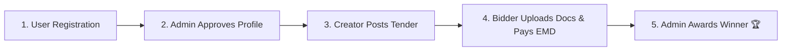

# 🏛️ eBharat Tender (E-Procurement System)

> **Simple Summary:** An online platform built with Django where government & private organizations post tenders, and contractors apply with document uploads and EMD payments.

---

## 📌 Project Overview (Yeh Project Kya Karte Hai?)

**eBharat Tender** ek e-bidding portal hai jo purane offline tender process ko online karta hai:
1. **Tender Creator (Organization)**: Naya tender post karta hai.
2. **Contractor / Bidder**: Tenders dhundta hai, apne documents upload karta hai aur EMD fee pay karke bid lagata hai.
3. **Admin**: Profiles approve karta hai, bids review karta hai aur winning contractor ko tender award (🏆) karta hai.

---

## 📸 Screenshots & Image Placement (Yahan Screenshots Lagayein)

> 📁 **Instructions:** Apne project root me `assets/screenshots/` naam ka folder banayein aur usme images rakhein.

### 1. Home Page (Main Landing Page)
- **Image Location:** `assets/screenshots/01_home.png`
- **Markdown Code to Copy:**
```markdown

```
*Description:* Public home screen showing recent tenders and search options.

---

### 2. User Registration & KYC Upload
- **Image Location:** `assets/screenshots/02_registration.png`
- **Markdown Code to Copy:**
```markdown

```
*Description:* Registration page where users upload Aadhaar / PAN / GSTIN for profile approval.

---

### 3. Tender List & Search
- **Image Location:** `assets/screenshots/03_tender_list.png`
- **Markdown Code to Copy:**
```markdown

```
*Description:* Tender catalog page with filtering by category, location, and department.

---

### 4. Tender Details Page
- **Image Location:** `assets/screenshots/04_tender_detail.png`
- **Markdown Code to Copy:**
```markdown

```
*Description:* Detailed view of a tender with Auto Tender ID (e.g., EBT-2026-0001) and document downloads.

---

### 5. Bid Application & Document Upload
- **Image Location:** `assets/screenshots/05_bid_submission.png`
- **Markdown Code to Copy:**
```markdown

```
*Description:* Form for bidders to upload GST certificates, technical documents, and financial quotes.

---

### 6. Razorpay EMD Payment Gateway
- **Image Location:** `assets/screenshots/06_razorpay_emd.png`
- **Markdown Code to Copy:**
```markdown

```
*Description:* Online EMD fee payment modal powered by Razorpay.

---

### 7. Admin Dashboard & Awarding
- **Image Location:** `assets/screenshots/07_admin_dashboard.png`
- **Markdown Code to Copy:**
```markdown

```
*Description:* Admin portal to approve user profiles, evaluate bids, and declare winner.

---

## 🔄 Simple Project Flow (Kaise Kaam Karta Hai?)



1. **Step 1 (Account Creation)**: User register karta hai (Tender Creator ya Bidder) aur Aadhaar/PAN upload karta hai.
2. **Step 2 (KYC Approval)**: Admin profile aur ID check karke approve karta hai.
3. **Step 3 (Tender Posting)**: Creator naya tender daalta hai. System auto Tender ID (`EBT-2026-0001`) generate karta hai.
4. **Step 4 (Bidding & Payment)**: Bidder bid bharhta hai, Financial/Technical PDFs upload karta hai aur Razorpay se EMD pay karta hai.
5. **Step 5 (Contract Award)**: Admin best bid select karta hai aur winner declare karta hai.

---

## 🔑 Main Features

- 👤 **Two User Roles**: Tender Creator & Bidder.
- 🆔 **Gov ID Masking**: Aadhaar/PAN numbers safety ke liye hide ho jaate hain (`********1234`).
- 🔢 **Auto Tender ID**: Har tender ko unique ID milti hai (Jaise: `EBT-2026-0001`).
- 💳 **Razorpay Payment Integration**: Safe EMD payment processing.
- ☁️ **Cloud Storage**: Cloudinary support file & PDF uploads ke liye.
- 🔔 **Notifications**: Real-time updates status change par.

---

## 📂 Project Structure (📁 Files Location)

- `accounts/` ➔ User register, login & ID proof upload.
- `tenders/` ➔ Tender creation, list, filter & details.
- `bids/` ➔ Bid submission & Razorpay EMD payment.
- `coreadmin/` ➔ Admin approval & winner declaration panel.
- `funding/` ➔ Budget allocation & funding tracking.
- `public/` ➔ Landing page.

---

## 🚀 How to Run the Project (Easy Setup)

### 1. Project Download Karein
```bash
git clone https://github.com/YOUR_USERNAME/ebharatTender.git
cd ebharatTender
```

### 2. Virtual Environment Banayein
```bash
python -m venv .venv
.venv\Scripts\activate
```

### 3. Dependencies Install Karein
```bash
pip install -r requirements.txt
```

### 4. Database Setup
```bash
cd eBhatat_Tender
python manage.py migrate
python manage.py createsuperuser
```

### 5. Server Run Karein
```bash
python manage.py runserver
```
Browser me open karein: `http://127.0.0.1:8000/`

---

## 📜 License

This project is licensed under the **MIT License**.
